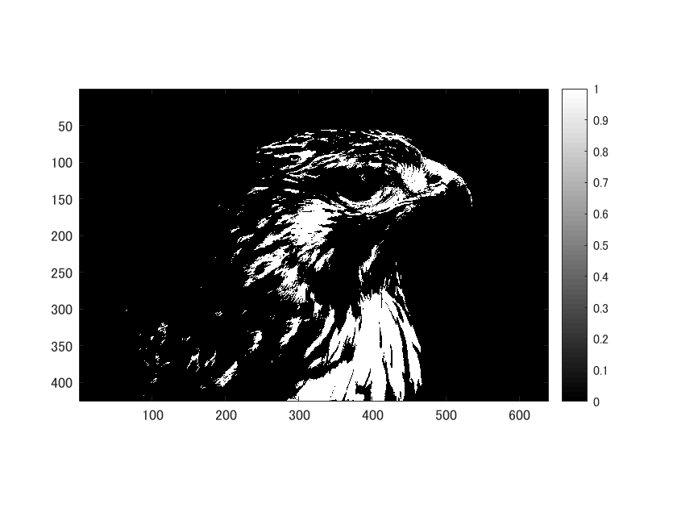
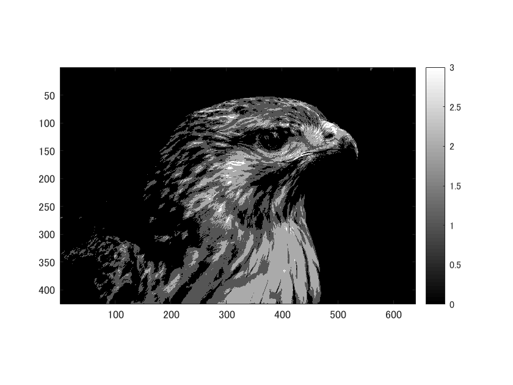
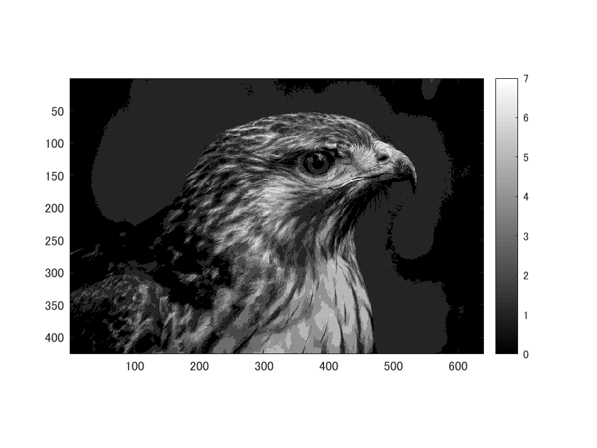

MATLABを用いて、２諧調、４諧調、８諧調の画像を生成する。
画像は、「tori」を用いる。

ORG=imread('tori.jpg'); 

ORG = rgb2gray(ORG); colormap(gray); colorbar;

imagesc(ORG); axis image; 

で画像を入力して表示した画像を図１に示す。

図１　グレースケールの標準画像「tori」

まず、２諧調の画像を生成する。

0~128と129~255に分ける。

IMG = ORG>128;

imagesc(IMG); colormap(gray); colorbar;  axis image;

で２諧調にした画像を図２に示す。

図２　２諧調での画像

次に、４諧調の画像を生成する。

0~64,65~128,129~192,193~255のように４つに分ける。

IMG0 = ORG>64;

IMG1 = ORG>128;

IMG2 = ORG>192;

IMG = IMG0 + IMG1 + IMG2;

imagesc(IMG); colormap(gray); colorbar;  axis image;

で４諧調にした画像を図３に示す。

図３　４諧調での画像

最後に、８諧調の画像を生成する。

0~32,33~64,65~96,97~128,129~160,161~192,193~224,225,255のように８つに分ける。

IMG0 = ORG>32;

IMG1 = ORG>64;

IMG2 = ORG>96;

IMG3 = ORG>128;

IMG4 = ORG>160;

IMG5 = ORG>192;

IMG6 = ORG>224;

IMG = IMG0 + IMG1 + IMG2 + IMG3 + IMG4 + IMG5 + IMG6;

imagesc(IMG); colormap(gray); colorbar;  axis image;

で８諧調にした画像を図４に示す。

図４　８諧調での画像

諧調数を上げていくと画像が鮮明になっていくことが分かる。

