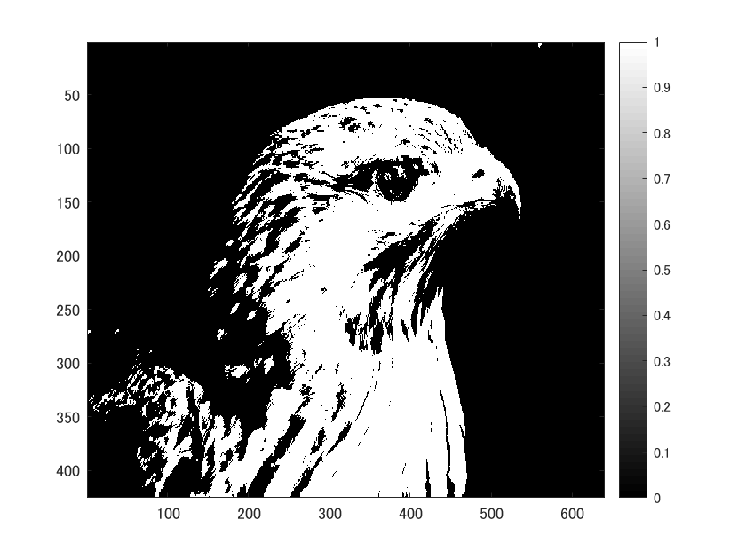
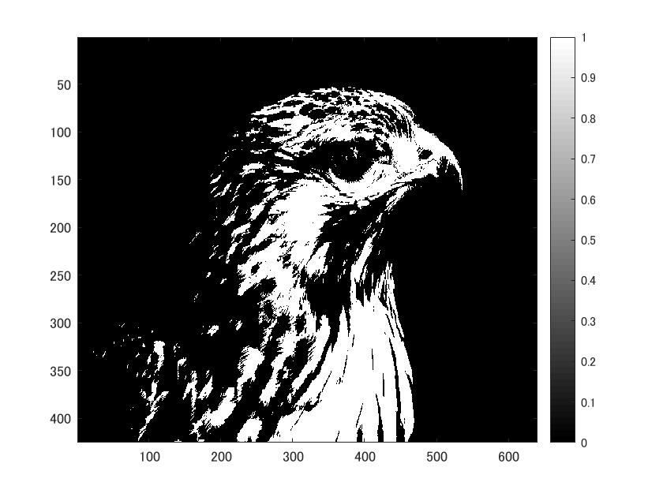
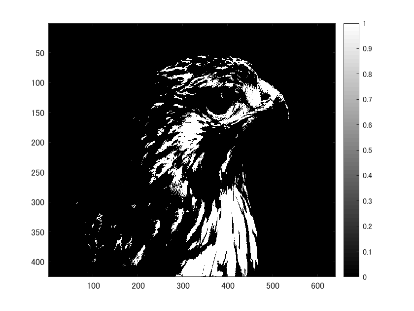
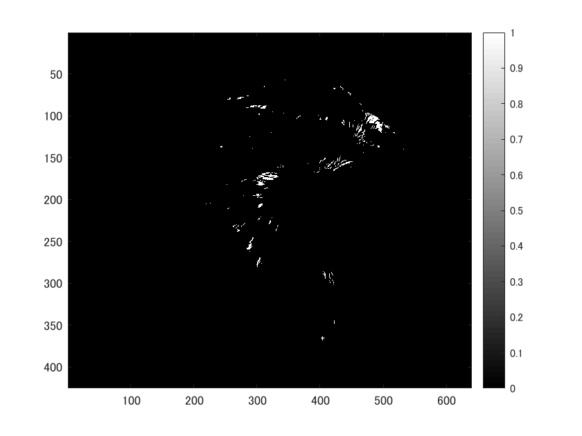

閾値を4パターンに設定し、閾値処理をした画像を示す。

ORG=imread('tori.jpg'); 

ORG= rgb2gray(ORG); 

imagesc(ORG); colormap(gray); colorbar;

によって画像を入力し、白黒にした画像を図１に示す。

図１　白黒画像

まず、輝度値が64以上の画素を1、その他を0にした画像を示す。

IMG = ORG > 64; 

imagesc(IMG); colormap(gray); colorbar;

によって閾値処理した画像を図２に示す。

図２　閾値処理した画像(輝度値が64以上の画素が1)

次に、輝度値が96以上の画素を1、その他を0にした画像を示す。

IMG = ORG > 96;

imagesc(IMG); colormap(gray); colorbar;

によって閾値処理した画像を図３に示す。

図３　閾値処理した画像(輝度値が96以上の画素が1)

画素が1になる条件を厳しくしたため、図２の画像よりも黒色がおおくなっている。
次に、輝度値が128以上の画素を1、その他を0にした画像を示す。

IMG = ORG > 128;

imagesc(IMG); colormap(gray); colorbar;

によって閾値処理した画像を図４に示す。

図４　閾値処理した画像(輝度値が128以上の画素が1)

最後に、輝度値が192以上の画素を1、その他を0にした画像を示す。

IMG = ORG > 192;

imagesc(IMG); colormap(gray); colorbar;

によって閾値処理した画像を図５に示す。

図５　閾値処理した画像(輝度値が192以上の画素が1)

ほぼ黒色の画像になっていることがわかる。

