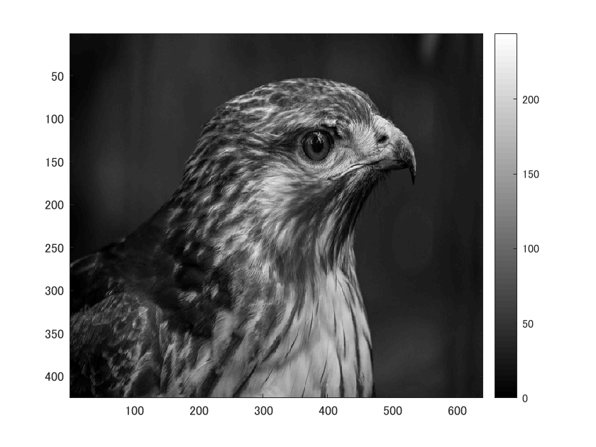
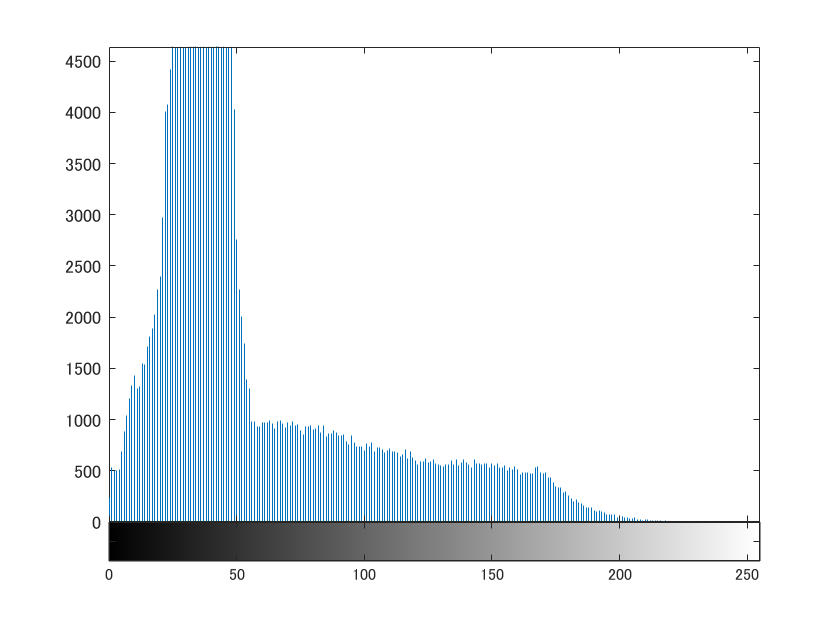

画像の濃度ヒストグラムを生成する。

ORG=imread('tori.jpg'); 

ORG=rgb2gray(ORG); 

imagesc(ORG); colormap(gray); colorbar;

によって入力した画像を図１に示す。

図１　白黒濃淡画像

そして、

imhist(ORG); 

によって生成した濃度ヒストグラムを図２に示す。

図２　濃度ヒストグラム

黒色の成分が多いことがわかる。この黒色の成分は背景の成分であると考えられる。
