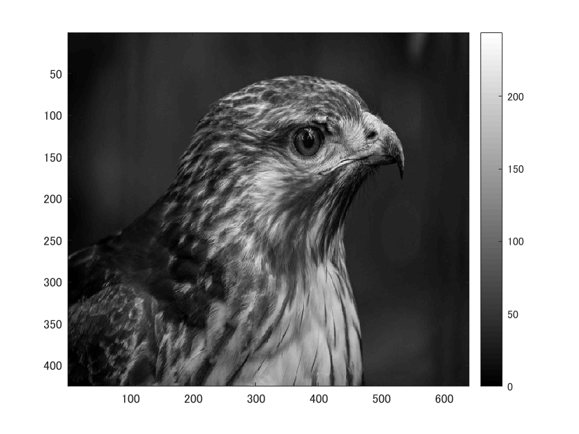
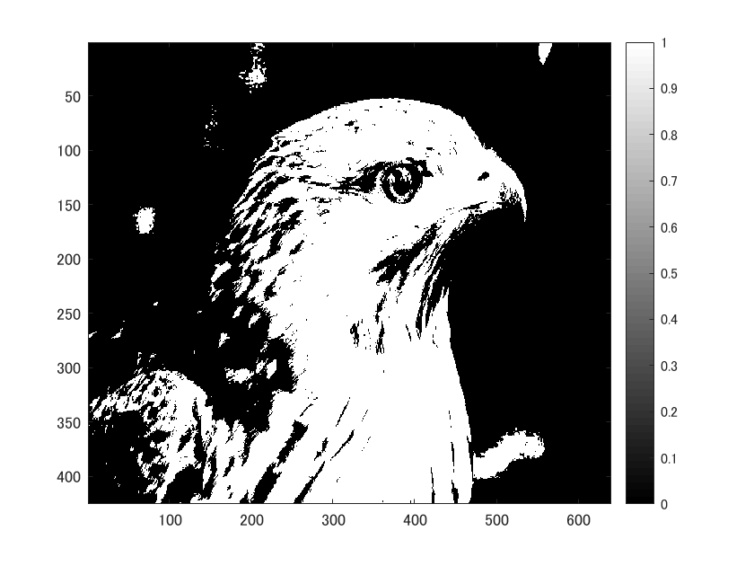

判別分析法を用いて画像を２値化する。

ORG=imread('tori.jpg'); 

ORG = rgb2gray(ORG); 

imagesc(ORG); colormap(gray); colorbar;

によって入力した画像を図１に示す。

図１　白黒濃淡画像

次に、判別分析法を用いて画像の２値化を行う。

H = imhist(ORG); %ヒストグラムのデータを列ベクトルEに格納

myu_T = mean(H);

max_val = 0;

max_thres = 1;

for i=1:255

C1 = H(1:i); %ヒストグラムを2つのクラスに分ける

C2 = H(i+1:256);

n1 = sum(C1); %画素数の算出

n2 = sum(C2);

myu1 = mean(C1); %平均値の算出

myu2 = mean(C2);

sigma1 = var(C1); %分散の算出

sigma2 = var(C2);

sigma_w = (n1 *sigma1+n2*sigma2)/(n1+n2); %クラス内分散の算出

sigma_B = (n1 *(myu1-myu_T)^2+n2*(myu2-myu_T)^2)/(n1+n2); %クラス間分散の算出

if max_val<sigma_B/sigma_w

max_val = sigma_B/sigma_w;

max_thres =i;

end;

end;

これにより、判別分析法を行う。

そして、

IMG = ORG > max_thres;

imagesc(IMG); colormap(gray); colorbar;

によって表示した画像を図２に示す。

図２　判別分析法を用いて２値化した画像

