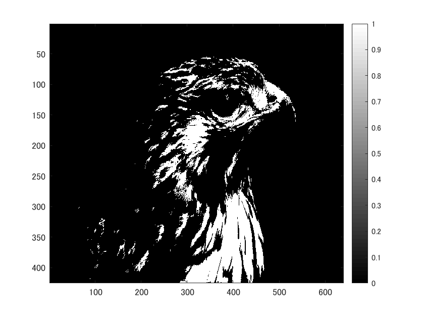

画像を２値化する。

ORG=imread('tori.jpg'); 

ORG = rgb2gray(ORG);

imagesc(ORG); colormap(gray); colorbar;

によって入力した画像を図１に示す。

図１　白黒濃淡画像

まず、輝度値が128以上の画素を1、それ以外を0にすることで２値化する。

IMG = ORG>128; % 128による二値化

imagesc(IMG); colormap(gray); colorbar; % 画像の表示

によって２値化した画像を図２に示す。

図２　128による２値化

次に、ディザ法を用いて画像を２値化する。

IMG = dither(ORG); % ディザ法による二値化

imagesc(IMG); colormap(gray); colorbar; % 画像の表示

によって２値化した画像を図３に示す。

図３　ディザ法による２値化

図２の画像よりもわかりやすい画像になっていることがわかる

